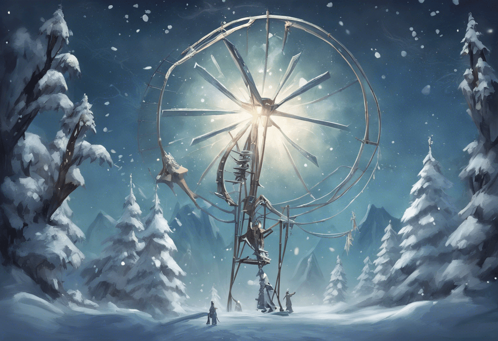

# Задача 1 - Требушет?!

## Предисловие

Что-то не так с глобальным производством снега, и вы были выбраны, чтобы это проверить. 
Они даже дали вам карту.


Вы пытаетесь спросить, почему они не могут просто использовать метеорологическую машину, 
и куда они вообще вас отправляют, когда понимаете, что эльфы уже загружают тебя в требушет ("пожалуйста, держись, нам нужно тебя пристегнуть в").



## Условие Задачи

Внося последние коррективы, они обнаруживают, 
что их калибровочный документ [ваш вводный код головоломки](../src/main/resources/puzzle_input.txt) 
был изменен очень молодой эльфийкой, которая, очевидно, 
просто хотела продемонстрировать свои художественные навыки. 
Из-за этого у эльфов возникли проблемы с чтением чисел в документе.


"Улучшенный" калибровочный документ состоит из строк текста; 
каждая строка изначально содержала определенное значение калибровки, 
которое теперь необходимо восстановить эльфам. 
В каждой строке значение калибровки можно найти путем объединения первой 
и последней цифр (именно в этом порядке) в одно двузначное число.

```txt
1abc2
pqr3stu8vwx
a1b2c3d4e5f
treb7uchet
```
В этом примере калибровочные значения этих четырех строк составляют 12, 38, 15 и 77. Их сложение дает 142.

Рассмотрите весь свой [калибровочный документ](../src/main/resources/puzzle_input.txt).

**Какова сумма всех калибровочных значений?**

